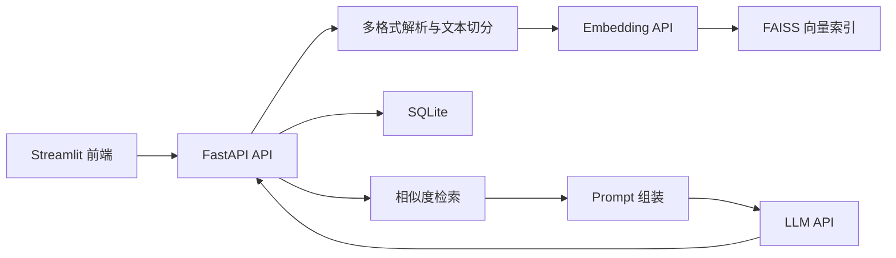

# RAG 智能文档问答系统

基于 FastAPI、FAISS、SQLite 和 Streamlit 实现的轻量级检索增强生成（RAG）文档问答系统。系统支持 TXT / PDF / Word 文档上传、文本切分、向量化检索、基于上下文的 LLM 问答、引用来源返回、SSE 流式输出和 Docker Compose 部署。

## 项目亮点

- 打通文档上传、文本切分、Embedding、FAISS 检索和 LLM 生成的 RAG 全流程
- 使用 FAISS 保存语义索引，使用 SQLite 持久化文档、会话和消息等业务数据
- **混合检索**：向量召回 + BM25 关键词召回加权融合（`VECTOR_WEIGHT` 可调），专有名词、精确词召回率显著提升
- **Rerank 精排**：BGE-Reranker 对召回候选池二次精排，提升 Top-K 准确率（`RERANK_ENABLED` 可开关）
- **分级记忆**：短期（最近 N 轮对话）+ 长期（历史问答语义检索），多轮问答更连贯
- **多格式解析**：支持 TXT / PDF / Word 文档
- **自动化评估**：Golden Dataset + Hit Rate / MRR 指标，量化检索效果
- 在 Prompt 中约束回答范围，并返回文件名和段落编号，支持答案来源追溯
- 支持普通响应和 SSE 流式响应，改善长回答的交互体验
- 使用 FastAPI 路由分层、业务异常处理、统一日志和 Docker Compose 完成工程化组织
- 默认通过 `CHUNK_SIZE`、`CHUNK_OVERLAP` 和 `TOP_K` 环境变量控制文本切分与检索参数

## 技术栈

| 模块 | 技术 |
| --- | --- |
| 后端 | FastAPI、Uvicorn |
| 前端 | Streamlit |
| 混合检索 | FAISS `IndexFlatL2` + BM25（`rank_bm25` + `jieba` 分词） |
| Rerank 精排 | BGE-Reranker（`sentence-transformers` CrossEncoder） |
| 分级记忆 | 短期 Memory List（SQLite）+ 长期语义检索（FAISS） |
| 文档解析 | TXT/MD、PDF（`PyMuPDF`）、Word（`python-docx`） |
| 数据持久化 | SQLite、SQLAlchemy ORM |
| 文本切分 | LangChain `RecursiveCharacterTextSplitter` |
| 模型接口 | 兼容 OpenAI 协议的 Embedding / Chat API |
| 配置与日志 | python-dotenv、Python logging |
| 部署 | Docker、Docker Compose |

## 系统流程



### 文档上传

用户上传 TXT / PDF / Word 文档后，后端依次完成文件解析、递归文本切分、向量生成，并将向量和元数据保存到 FAISS；文件名、大小和分块数量保存到 SQLite。

### 问答检索

用户问题首先生成查询向量，随后从 FAISS 召回 Top-K 个文本片段。系统将片段及文件名、段落号拼接到 Prompt 中，调用 LLM 生成回答，并返回相关片段和来源信息。

## 项目结构

```text
rag_new/
├── app.py                         # Streamlit 前端入口
├── main.py                        # FastAPI 服务入口
├── requirements.txt               # Python 依赖
├── docker-compose.yml             # 前后端容器编排
├── Dockerfile.backend
├── Dockerfile.frontend
├── app/
│   ├── api/
│   │   ├── chat.py                # 健康检查、普通和流式接口
│   │   └── rag.py                 # 上传、检索、问答、会话接口
│   ├── core/
│   │   ├── config.py              # 环境变量配置
│   │   ├── database_models.py     # 数据库连接与 Base
│   │   ├── exceptions.py          # 业务异常
│   │   └── logger.py              # 日志配置
│   ├── models/
│   │   └── database_models.py     # 数据表模型
│   └── services/
│       ├── embedding_service.py   # Embedding 接口封装
│       ├── file_service.py        # 文件解析（txt/md/pdf/docx）
│       ├── llm_service.py         # LLM 同步 / 流式调用
│       ├── splitter_service.py    # 文本切分
│       ├── vector_store.py        # FAISS 增删查和持久化
│       ├── bm25_store.py          # BM25 关键词索引（混合检索关键词路）
│       ├── retrieval_service.py   # 混合检索：向量 + BM25 加权融合 + Rerank
│       ├── rerank_service.py      # BGE-Reranker 精排
│       ├── memory_store.py        # 长期记忆向量库（历史问答）
│       └── memory_service.py      # 分级记忆：短期历史 + 长期召回
├── data/vector_store/             # faiss.index、documents.json、bm25_corpus.json
├── data/memory_store/             # memory.index、memory.json（长期记忆）
├── eval/                          # 检索效果自动化评估
│   ├── golden_dataset.json        # 标准问答对（问题 + 期望关键词）
│   └── evaluate.py                # 评估脚本（Hit Rate / MRR，可对比有无 Rerank）
└── logs/                          # 运行日志
```

## 效果评估

项目内置了基于 Golden Dataset 的自动化评估，量化检索链路效果：

```bash
# 完整链路（混合检索 + Rerank）
.venv/Scripts/python.exe eval/evaluate.py --top-k 5

# 关闭 Rerank，量化精排收益
.venv/Scripts/python.exe eval/evaluate.py --no-rerank
```

指标：**Hit Rate@K**（Top-K 召回命中率）与 **MRR**（平均倒数排名）。

当前基准（18 条标准问答对，Top-5）：

| 模式 | Hit Rate@5 | MRR |
| --- | --- | --- |
| 混合检索 + Rerank | 88.9% | 0.889 |
| 混合检索（无 Rerank） | 88.9% | 0.637 |

Rerank 使 MRR 提升约 40%（0.637 → 0.889），即把正确答案的排名显著提前。

## 快速开始

### 1. 安装依赖

建议使用 Python 3.10 及以上版本：

```bash
python -m venv .venv
# Windows
.venv\Scripts\activate
# macOS / Linux
# source .venv/bin/activate
pip install -r requirements.txt
```

### 2. 配置环境变量

在项目根目录创建 `.env`：

```env
LLM_API_KEY=你的大模型API密钥
LLM_BASE_URL=https://api.deepseek.com/v1
LLM_MODEL_NAME=deepseek-chat
EMBEDDING_API_KEY=你的向量模型API密钥
EMBEDDING_BASE_URL=向量模型接口地址
EMBEDDING_MODEL=text-embedding-v2
TOP_K=1
CHUNK_SIZE=500
CHUNK_OVERLAP=50
# 混合检索：向量权重（0~1），越大越偏语义，越小越偏关键词
VECTOR_WEIGHT=0.5
# 混合检索：两路各自召回的候选数，融合后取 TOP_K
BM25_RECALL_K=20
# Rerank 精排开关（true/false）
RERANK_ENABLED=true
# Rerank 模型（默认指向本地 models/bge-reranker-base；也可填 HF 仓库名自动下载）
RERANK_MODEL=BAAI/bge-reranker-base
# 精排前的候选池大小
RERANK_RECALL_K=20
# 分级记忆：短期最近 N 轮
MEMORY_RECENT_TURNS=5
# 分级记忆：长期召回历史条数
MEMORY_LONG_TOP_K=3
```

不要将 `.env`、API Key 或本地数据库提交到 Git。

### 3. 启动后端和前端

后端：

```bash
uvicorn main:app --reload
```

前端另开终端：

```bash
streamlit run app.py
```

- 前端地址：`http://127.0.0.1:8501`
- Swagger：`http://127.0.0.1:8000/docs`
- 健康检查：`http://127.0.0.1:8000/health`

### 4. Docker Compose 启动

配置 `.env` 后执行：

```bash
docker compose up --build
```

前端访问 `http://127.0.0.1:8501`，后端访问 `http://127.0.0.1:8000/docs`。

## 核心接口

| 方法 | 路径 | 说明 |
| --- | --- | --- |
| GET | `/health` | 健康检查 |
| POST | `/rag/upload` | 上传文档（TXT / PDF / Word）并构建向量库 |
| POST | `/rag/ask` | 仅检索相关文本片段 |
| POST | `/rag/answer` | 检索增强问答并返回来源 |
| POST | `/rag/conversation/create` | 创建会话 |
| POST | `/rag/clear` | 清空向量库和文档记录 |
| POST | `/chat` | 普通响应接口 |
| POST | `/chat/stream` | SSE 流式响应接口 |

问答请求示例：

```json
{
  "question": "公司迟到扣款规则是什么",
  "conversation_id": 1
}
```

## 已知限制

- 扫描版 PDF（纯图片）暂不支持 OCR 文字识别
- 当前使用本地 FAISS 和 SQLite，适合单机或小规模知识库
- 用户身份暂使用默认 `user_id=1`，尚未接入鉴权和多租户隔离
- Embedding 维度当前固定为 1024，需要与所配置的向量模型保持一致
- 当前前端为演示型 Streamlit 页面，未提供完整的文档管理和历史会话列表

## 后续计划

- 接入用户鉴权、访问限流和多用户数据隔离
- 增加自动化测试、RAG 评估指标和持续集成
- 根据数据规模评估迁移至 Milvus 或 PGVector
- 扫描版 PDF 接入 OCR（如 PaddleOCR / RapidOCR）


