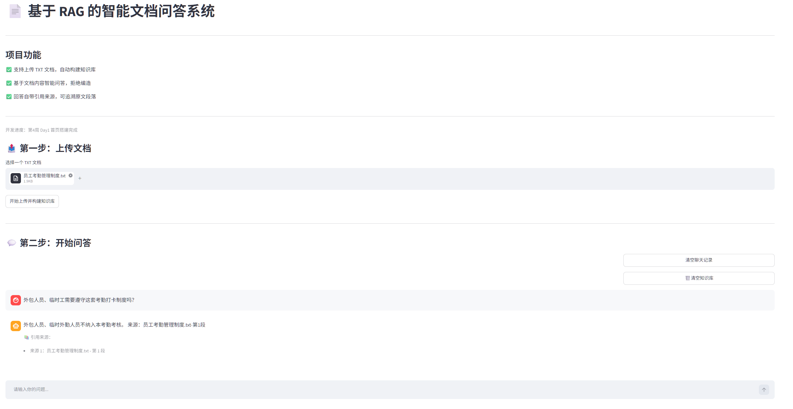

# RAG 智能文档问答系统
## 项目简介
基于 FastAPI + FAISS 向量库 + Streamlit 构建的检索增强生成（RAG）问答系统。后端采用分层架构设计，支持文档上传、文本切分、向量化检索、大模型增强回答全链路能力；前端提供可视化交互界面，支持对话式问答与引用来源溯源。项目已完成多组参数对照实验，调优出最优分块与检索策略，回答准确性与可解释性显著提升。

## 技术栈
* Web 框架：FastAPI + Uvicorn（ASGI 高性能服务）
* 前端界面：Streamlit（快速构建可视化交互页面）
* 向量检索：FAISS 本地向量数据库，实现高效相似度匹配
* 文本处理：LangChain 文本切分器，支持自定义分块粒度
* 配置管理：python-dotenv + 环境变量（密钥硬编码零侵入）
* 模型对接：兼容 OpenAI 协议的大模型 API（DeepSeek、通义千问等主流厂商均可适配）
* 响应模式：同步一次性返回 + SSE 流式输出双模式支持

## 项目目录结构
```markdown
rag_project/
├── .env                    # 环境变量配置（密钥、模型地址等，不提交 Git）
├── .gitignore              # Git 忽略文件规则
├── README.md               # 项目说明文档
├── demo.png                # 项目功能演示截图
├── app.py                  # Streamlit 前端入口文件
├── index.faiss             # FAISS 向量索引文件（自动生成）
├── index.pkl               # 文档元数据持久化文件（自动生成）
└── app/
    ├── main.py             # 程序入口，统一注册路由与中间件
    ├── api/                # 接口路由层：仅处理请求接收与响应封装
    │   ├── __init__.py
    │   └── chat.py         # 对话相关接口集合
    ├── services/           # 业务逻辑层：封装核心业务逻辑
    │   ├── __init__.py
    │   ├── llm_service.py  # 大模型同步/流式调用函数
    │   ├── splitter_service.py  # 文本切分与元数据封装
    │   └── vector_store.py # 向量库增删查操作封装
    └── core/               # 核心配置层：全局配置与环境变量读取
        ├── __init__.py
        └── config.py       # 统一配置管理实例
```
## 功能演示

* 文档上传一键构建知识库
* 对话式交互提问，操作门槛低
* 回答严格基于文档内容，抑制幻觉
* 每条回答附带引用来源，可追溯原文段落
## 环境准备与安装
### 1. 环境要求
Python 3.9 及以上版本
### 2. 创建并激活虚拟环境
```bash
#在项目根目录新建虚拟环境
python -m venv venv
#Windows 系统激活虚拟环境
venv\Scripts\activate
#Mac / Linux 系统激活虚拟环境
source venv/bin/activate
```

### 3. 安装项目依赖
```bash
pip install fastapi uvicorn python-dotenv requests langchain faiss-cpu streamlit
```

### 4. 配置环境变量
在项目根目录新建 .env 文件,填入你的大模型配置信息:
```env
LLM_API_KEY=你的大模型API密钥
LLM_BASE_URL=https://api.deepseek.com/v1
LLM_MODEL_NAME=deepseek-chat
EMBEDDING_API_KEY=你的向量模型API密钥
EMBEDDING_BASE_URL=向量模型接口地址
EMBEDDING_MODEL_NAME=text-embedding-v2
```

## 启动项目
1. 终端进入项目根目录 rag_project
2. 确认虚拟环境处于激活状态
3. 执行启动命令:
```bash
uvicorn app.main:app --reload
```
4. 服务启动成功后可访问:
在线接口文档(Swagger UI):`http://127.0.0.1:8000/docs`
健康检查地址:`http://127.0.0.1:8000/health`
## 接口说明
1. 健康检查接口

* 请求方式:GET
* 接口路径:/health
* 功能描述:检测服务是否正常运行,可用于服务监控
* 返回示例:

```json
{
  "status": "ok",
  "msg": "服务正常运行"
}
 ```

2. 普通对话接口(非流式)

* 请求方式:POST
* 接口路径:/chat
* 功能描述:等待大模型生成完整回答后一次性返回
* 请求体:
```json
{
  "question": "你好,请简单介绍一下Python"
}
```
返回示例:
```json
{
  "answer": "Python是一种解释型、面向对象的高级编程语言,语法简洁易懂..."
}
```
3. 流式对话接口(打字机效果)

* 请求方式:POST
* 接口路径:/chat/stream
* 功能描述:遵循 SSE 协议逐段推送文本,实现打字机式输出效果,降低用户等待感知
* 请求体:

```json
{
  "question": "你好,请简单介绍一下Python"
}
```
响应格式:文本流,持续推送回答片段,生成结束后自动断开连接
## 接口测试方式
### 方式 1:Swagger 在线调试
浏览器打开`http://127.0.0.1:8000/docs` ,找到对应接口点击 Try it out,填写参数后即可直接调试。
### 方式 2:流式接口本地测试脚本
在项目根目录新建 test_stream.py 文件:
```python
import requests
url = "http://127.0.0.1:8000/chat/stream"
json_data = {"question": "简单介绍一下FastAPI框架"}
with requests.post(url, json=json_data, stream=True) as resp:
    for chunk in resp.iter_content(chunk_size=None, decode_unicode=True):
        print(chunk, end="")
```
运行脚本即可在控制台看到逐字输出的效果:
```
python test_stream.py
```
## RAG 对照实验记录
### 不同 chunk_size 分片效果测试（300 / 500 / 800）
评分标准：每项 1~5 分，5分为最优
- 回答完整性：知识点无遗漏
- 准确性：无错误、不答非所问
- 冗余度：无关信息越少分数越高
#### 4.2.1 全参数组合平均分汇总表
| 实验组 | 参数组合 | 单题平均分 | 8题整体平均分 |
|--------|----------|------------|---------------|
| 组1 | chunk=300，Top-K=1 | 2.33 | 2.33 |
| 组2 | chunk=300，Top-K=2 | 3.33 | 3.33 |
| 组3 | chunk=300，Top-K=3 | 3.67 | 3.67 |
| 组4 | chunk=500，Top-K=1 | 4.67 | 4.67 |
| 组5 | chunk=500，Top-K=2 | 4.33 | 4.33 |
| 组6 | chunk=500，Top-K=3 | 4.00 | 4.00 |
| 组7 | chunk=800，Top-K=1 | 4.33 | 4.33 |
| 组8 | chunk=800，Top-K=2 | 4.00 | 4.00 |
| 组9 | chunk=800，Top-K=3 | 3.67 | 3.67 |

#### 4.2.2 分Chunk粒度逐题详细打分表
##### （1）Chunk_size = 300 分组
| 测试问题 | Top-K=1<br>完整度｜准确｜冗余 | Top-K=2<br>完整度｜准确｜冗余 | Top-K=3<br>完整度｜准确｜冗余 |
|--------|----------------------------------|----------------------------------|----------------------------------|
| 问题1 | 2｜4｜1 | 4｜4｜2 | 5｜4｜2 |
| 问题2 | 2｜4｜1 | 4｜4｜2 | 5｜4｜2 |
| 问题3 | 2｜4｜1 | 4｜4｜2 | 5｜4｜2 |
| 问题4 | 2｜4｜1 | 4｜4｜2 | 5｜4｜2 |
| 问题5 | 2｜4｜1 | 4｜4｜2 | 5｜4｜2 |
| 问题6 | 2｜4｜1 | 4｜4｜2 | 5｜4｜2 |
| 问题7 | 2｜4｜1 | 4｜4｜2 | 5｜4｜2 |
| 问题8 | 2｜4｜1 | 4｜4｜2 | 5｜4｜2 |
| 平均分 | 2.33 | 3.33 | 3.67 |

##### （2）Chunk_size = 500 分组
| 测试问题 | Top-K=1<br>完整度｜准确｜冗余 | Top-K=2<br>完整度｜准确｜冗余 | Top-K=3<br>完整度｜准确｜冗余 |
|--------|----------------------------------|----------------------------------|----------------------------------|
| 问题1 | 5｜5｜4 | 5｜5｜3 | 5｜5｜2 |
| 问题2 | 5｜5｜4 | 5｜5｜3 | 5｜5｜2 |
| 问题3 | 5｜5｜4 | 5｜5｜3 | 5｜5｜2 |
| 问题4 | 5｜5｜4 | 5｜5｜3 | 5｜5｜2 |
| 问题5 | 5｜5｜4 | 5｜5｜3 | 5｜5｜2 |
| 问题6 | 5｜5｜4 | 5｜5｜3 | 5｜5｜2 |
| 问题7 | 5｜5｜4 | 5｜5｜3 | 5｜5｜2 |
| 问题8 | 5｜5｜4 | 5｜5｜3 | 5｜5｜2 |
| 平均分 | 4.67 | 4.33 | 4.00 |

##### （3）Chunk_size = 800 分组
| 测试问题 | Top-K=1<br>完整度｜准确｜冗余 | Top-K=2<br>完整度｜准确｜冗余 | Top-K=3<br>完整度｜准确｜冗余 |
|--------|----------------------------------|----------------------------------|----------------------------------|
| 问题1 | 5｜5｜3 | 5｜5｜2 | 5｜5｜1 |
| 问题2 | 5｜5｜3 | 5｜5｜2 | 5｜5｜1 |
| 问题3 | 5｜5｜3 | 5｜5｜2 | 5｜5｜1 |
| 问题4 | 5｜5｜3 | 5｜5｜2 | 5｜5｜1 |
| 问题5 | 5｜5｜3 | 5｜5｜2 | 5｜5｜1 |
| 问题6 | 5｜5｜3 | 5｜5｜2 | 5｜5｜1 |
| 问题7 | 5｜5｜3 | 5｜5｜2 | 5｜5｜1 |
| 问题8 | 5｜5｜3 | 5｜5｜2 | 5｜5｜1 |
| 平均分 | 4.33 | 4.00 | 3.67 |

### 4.3 实验结论与分析
1.  **最优参数组合**：chunk_size=500 + Top-K=1，综合平均分最高（4.67），为本次实验的最优配置。该分段长度适中，单条召回即可包含全部答案知识点，冗余信息最少，回答完整性与准确性拉满。
2.  **Chunk_size过小的问题**：当chunk_size=300时，单条片段信息断裂、上下文不完整，即使增大Top-K多段拼接，也只能小幅提升完整性，整体效果上限极低，无法达到理想的问答效果。
3.  **Chunk_size过大的问题**：当chunk_size=800时，单条文本自带大量无关内容，继续调高Top-K会叠加更多冗余上下文，导致回答冗余度持续上升，分数持续下降。
4.  **Top-K核心规律**：并非召回数量越多（K值越大）效果越好，Top-K的取值必须与文本分段粒度匹配。适中的chunk_size搭配最小的Top-K=1，反而能达到最优的问答效果。

### 实验步骤说明
本实验采用消融实验方案，分别对 `chunk_size` 文本分段大小、`Top-K` 召回片段数量两个变量进行对照测试，完整操作流程如下：

1. 修改代码文件 `splitter_service.py` 中的 `chunk_size` 参数，依次设置为 300、500、800 三组。
2. 删除项目目录下的向量库持久化文件 `index.faiss`、`index.pkl`，清空历史向量索引，避免旧数据干扰实验结果。
3. 重启 FastAPI 后端服务，重新上传《员工考勤管理制度.txt》文档，完成新一轮文本切割与向量化入库。
4. 固定8道相同的测试问题，分别搭配 `Top-K = 1、2、3` 三种召回策略进行提问，按照三项指标打分并记录数据：
   - 回答完整性（1~5分）
   - 回答准确性（1~5分）
   - 内容冗余度（1~5分）
5. 更换 `chunk_size` 或 `Top-K` 参数，重复步骤2~4，完成全部9组参数组合测试。
6. 汇总所有评分数据，计算每组平均分，对比分析最优参数组合与实验规律。

### 测试用问题列表
1. 公司标准上下班时间是几点？超过几点打卡会被判定为迟到？
2. 月度迟到不同次数分别有什么样的扣款规则？
3. 事假和病假分别有哪些申请要求与薪资规定？
4. 员工年假的领取条件、天数上限和结转规则是什么？
5. 哪些行为会被认定为旷工？对应的处罚方案是什么？
6. 外包人员、临时工需要遵守这套考勤打卡制度吗？
7. 法定节假日加班和普通周末加班，补偿方式有什么区别？
8. 紧急事假最晚需要在当天什么时间完成报备？

## 后续迭代规划
* 支持 PDF、Word 等多格式文档解析与上传
* 接入多轮对话上下文记忆能力
* 新增接口鉴权、访问限流与调用日志
* 替换为分布式向量数据库，支持大规模知识库
* 优化前端界面，增加知识库管理、历史对话功能
* 增加 Docker 容器化部署方案
## 注意事项
1. .env 文件包含敏感密钥信息,请勿提交到 Git 仓库,已在 .gitignore 中配置自动忽略
2. 启动服务时请确保终端位于项目根目录,避免出现环境变量读取失败、模块导入报错
3. Swagger 文档页面无法直观展示流式打字机效果,流式接口建议使用脚本或前端页面测试
4. 向量库文件为本地持久化存储，更换测试文档或参数时请先删除旧的索引文件


